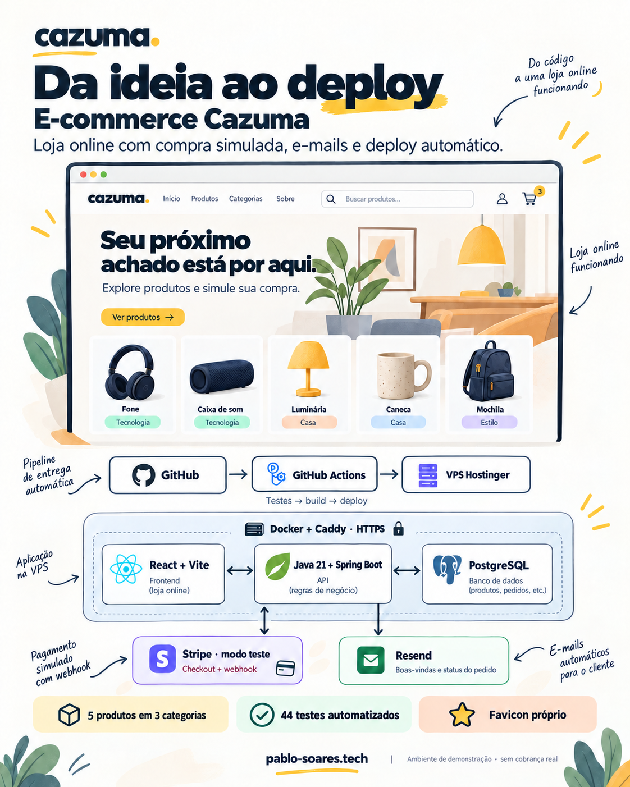

# Cazuma 🛍️

Uma loja online para explorar produtos, montar um carrinho e acompanhar uma compra do começo ao fim.

A Cazuma reúne uma interface em React, uma API em Java e as integrações necessárias para colocar o projeto no ar. Além do catálogo, o trabalho inclui autenticação, controle de estoque, pagamento de teste, e-mails automáticos e publicação em uma VPS.

**[Conheça a loja](https://pablo-soares.tech/)** · **[Acompanhe as automações](https://github.com/pbosoares/ecommerce/actions)**


## Experimente a loja

O site está em **modo de demonstração**. São cinco produtos fictícios nas categorias Tecnologia, Casa e Estilo. Não há cobrança nem entrega real.

1. Crie uma conta com um e-mail seu para receber as boas-vindas.
2. Escolha um produto e adicione ao carrinho.
3. Informe um CEP, consulte o frete e preencha o endereço.
4. No Stripe, use o cartão de teste `4242 4242 4242 4242`, uma validade futura e qualquer CVC de três dígitos.
5. Volte à loja e acompanhe a confirmação em **Meus pedidos**.

Os dados do cartão são preenchidos na página do Stripe. Use apenas dados fictícios no endereço desta demonstração. As instruções do cartão também aparecem na loja e na [documentação de testes do Stripe](https://docs.stripe.com/testing).

Os e-mails de boas-vindas e de atualização do pedido são enviados pela Resend. O primeiro envio costuma acontecer em até um minuto; se houver falha, a aplicação mantém a mensagem na fila para tentar novamente.

## O que já funciona

| Na experiência de quem compra | Por trás da aplicação |
| --- | --- |
| Cadastro e login | Senhas protegidas com Argon2 e autenticação JWT |
| Busca e filtros por categoria | Catálogo de produtos físicos e digitais |
| Carrinho e consulta de frete | Cálculo de valores no servidor e reserva de estoque |
| Checkout de teste | Integração Stripe com confirmação por webhook assinado |
| Histórico de pedidos | Cada cliente acessa apenas seus próprios pedidos |
| Minha conta e endereços salvos | Dados persistidos por cliente e preenchimento do endereço no checkout |
| Recuperação de senha por e-mail | Link temporário de uso único e revogação dos acessos anteriores |
| E-mails automáticos | Fila persistida com novas tentativas de envio |

A API também permite que administradores gerenciem produtos, categorias e etapas do pedido. Para produtos digitais, existe upload de arquivo privado e download autorizado após o pagamento. A vitrine pública atual usa apenas produtos físicos fictícios. Ainda não há um painel visual de administração.

## Como as peças se conectam

O React apresenta a loja e conversa com a API Spring Boot. A API guarda os dados no PostgreSQL, cria sessões de pagamento no Stripe e agenda os e-mails enviados pela Resend.

Na VPS Hostinger, o Docker Compose organiza os serviços. O Caddy serve o frontend e encaminha as chamadas para a API com HTTPS.

<details>
<summary>Ver a visão ilustrativa do projeto</summary>

A imagem abaixo foi criada para apresentar a arquitetura. A vitrine é uma ilustração, não uma captura da interface publicada.



</details>

| Tecnologia | Papel no projeto |
| --- | --- |
| Java 21 e Spring Boot | API, regras de negócio e integrações |
| React e Vite | Interface da loja e compilação do frontend |
| PostgreSQL e Flyway | Dados persistentes e evolução do banco |
| Spring Security, JWT e Argon2 | Autenticação, permissões e proteção das senhas |
| Stripe | Checkout e eventos de pagamento em modo de teste |
| Resend | Boas-vindas e notificações dos pedidos |
| Docker Compose e Caddy | Serviços da aplicação e HTTPS |
| GitHub Actions e Hostinger | Validação do código e deploy automático na VPS |

## Decisões que fizeram diferença

**O pagamento precisa de confirmação.** O retorno do navegador à loja não marca o pedido como pago. A API espera o webhook do Stripe e confere a assinatura, a sessão, a moeda e o valor recebido.

**O estoque acompanha o pedido.** A reserva acontece ao registrar a compra, com bloqueio no banco. Cancelamentos permitidos e expirações liberam essa reserva. Chaves de idempotência ajudam a evitar pedidos duplicados quando uma requisição é repetida.

**O e-mail pode esperar sem travar o cadastro.** A conta e a notificação de boas-vindas são gravadas na mesma transação. O envio acontece em segundo plano, com novas tentativas em caso de indisponibilidade da Resend.

**A publicação passa por validações.** O GitHub Actions executa os testes, compila o frontend e valida as imagens Docker. Depois, publica o commit testado, preserva os volumes e confere a saúde da aplicação. O processo também faz uma cópia do banco e dos arquivos digitais antes de atualizar uma instalação ativa.

Essas escolhas dão ao projeto exemplos concretos de integração entre frontend, backend, banco de dados e infraestrutura.

## Rode no seu computador 💻

Para conhecer o projeto sem configurar PostgreSQL ou serviços externos, use o perfil local `demo`.

Você precisa de **Java 21**, **Node.js 22** e **npm**. O Maven Wrapper já está no repositório.

### 1. Baixe o projeto

```bash
git clone https://github.com/pbosoares/ecommerce.git
cd ecommerce
```

### 2. Inicie a API

No Windows, com PowerShell:

```powershell
.\mvnw.cmd "-Dspring-boot.run.profiles=demo" spring-boot:run
```

No Linux ou macOS:

```bash
bash mvnw -Dspring-boot.run.profiles=demo spring-boot:run
```

### 3. Abra outro terminal e inicie o frontend

```bash
cd frontend
npm ci
npm run dev
```

Acesse **http://localhost:5173/**. A API atende em **http://localhost:8080/**.

O perfil local cria seis produtos fictícios em quatro categorias, incluindo um exemplo digital. Você pode testar cadastro, carrinho, frete e criação de pedidos. Nesse perfil, o fluxo não abre o Stripe nem confirma pagamentos automaticamente. Sem configurar a Resend, os e-mails ficam pendentes.

O banco H2 fica em memória. Os dados desaparecem ao encerrar a API, e esse perfil aceita conexões apenas no computador local.

## Testes e publicação 🚀

A suíte atual tem **56 testes automatizados**, incluindo autenticação, permissões, catálogo, carrinho, pedidos, webhooks, e-mails, minha conta, isolamento dos endereços salvos, recuperação de senha, uso simultâneo de links e regras dos ambientes de execução. Os testes usam H2 e não alteram o banco da loja publicada.

No Windows:

```powershell
.\mvnw.cmd --batch-mode --no-transfer-progress verify
```

No Linux ou macOS:

```bash
bash mvnw --batch-mode --no-transfer-progress verify
```

Para conferir a compilação do frontend, execute `npm run build` na pasta `frontend`.

| Perfil | Quando usar |
| --- | --- |
| `demo` | Apresentação local com banco descartável, sem checkout Stripe |
| `sandbox` | Demonstração na VPS com PostgreSQL, HTTPS, Stripe teste e Resend |
| `prod` | Configuração para pagamentos reais, com credenciais e preparação próprias |

A loja pública usa `sandbox`. Ele aceita apenas chaves Stripe de teste. O perfil `prod` exige uma chave de pagamento real. Segredos ficam fora do repositório.

Os detalhes de variáveis, acesso à VPS, backups e publicação estão no [guia de deploy](deploy/README.md).

## Documentação para ir além

* [Referência da API](docs/referencia-api.md): endpoints, exemplos de requisições, autenticação e regras dos pedidos.
* [Frontend](frontend/README.md): execução, integração com a API e compilação.
* [Deploy na VPS](deploy/README.md): ambientes, Docker, HTTPS, Stripe, Resend e GitHub Actions.

## Próximos passos

O projeto já permite demonstrar uma compra completa com pagamento de teste. Para continuar evoluindo, os próximos passos são um painel administrativo e melhor acompanhamento de falhas e disponibilidade.

O frete atual usa tarifas da própria loja, sem integração com transportadoras. Também não há estorno automático. Uma operação comercial real ainda precisa de validação operacional, monitoramento e testes de restauração dos backups.

Projeto de **[Pablo Soares](https://github.com/pbosoares)**. Fique à vontade para explorar o código e experimentar a loja.
